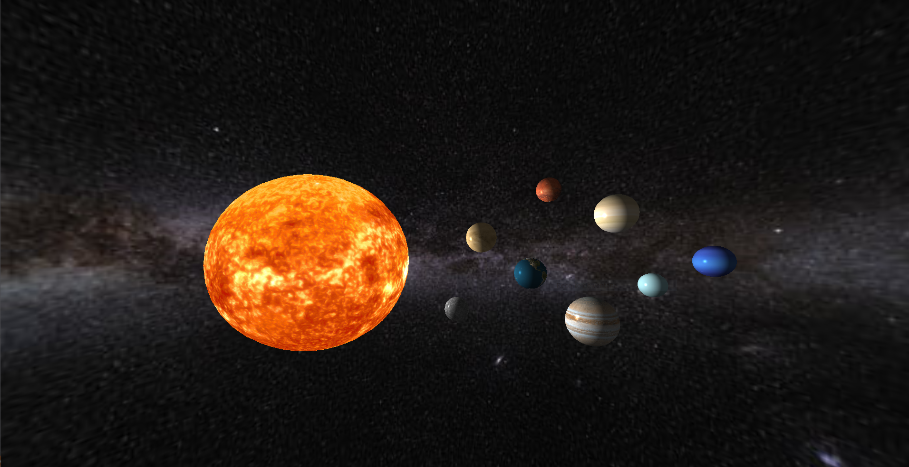

# 3DSolarSystem
3D Computer Graphics generation project focused on coding a 3D Solar System with vertex/fragment shaders, textures, lightning, as well as other aspects using the OpenGL API and mainly programmed in C/C++.

Mouse (left click) -> move camera view around
W -> move forward
A -> move left
D -> move right
S -> move backwards